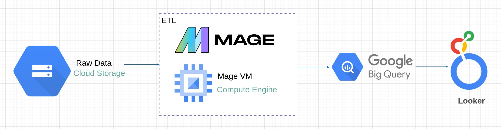
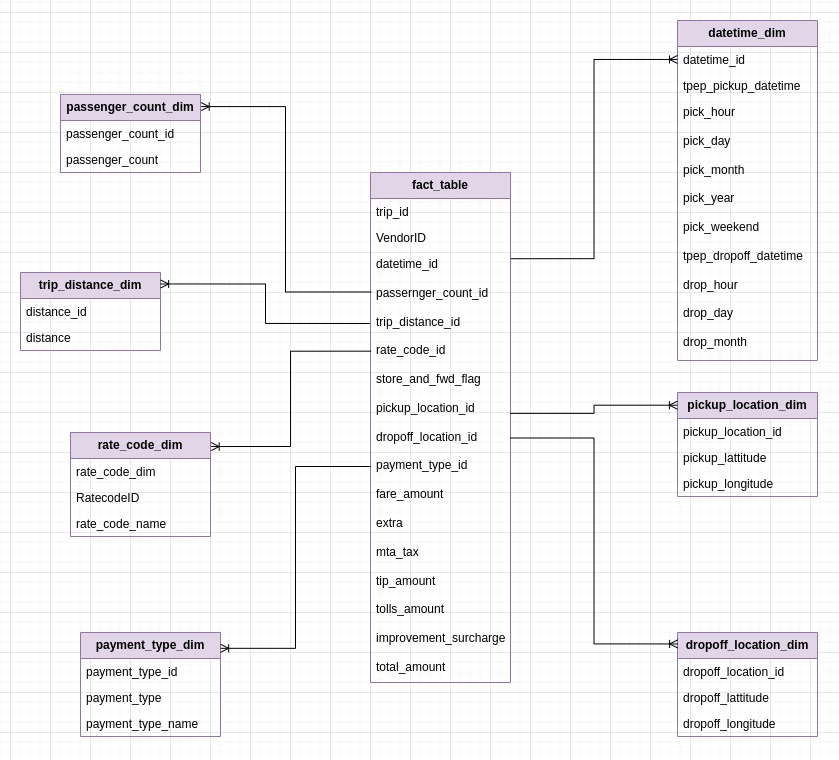
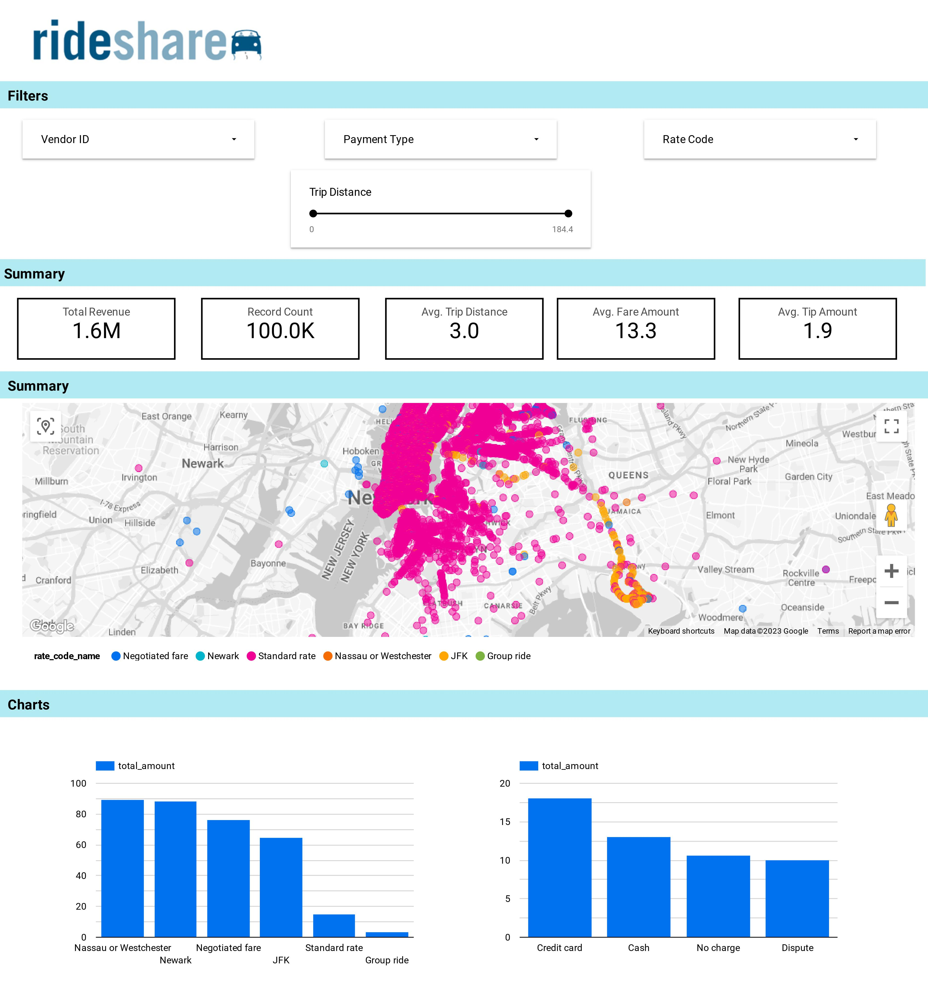

# Ride Sharing ETL Pipeline

A data pipeline with  GCP Storage, Python, Compute Instance, Mage Data Pipeline Tool, BigQuery, and Looker Studio.

## Description

### Objective

The goal of this project is to analyze Uber data using tools like GCP Storage, Python, Compute Instance, Mage Data Pipeline Tool, BigQuery, and Looker Studio. We aim to explore TLC Trip Record Data for yellow and green taxi trips, focusing on details like dates/times, locations, distances, fares, rate types, payment types, and passenger counts. The objective is to gain insights and perform data analytics for informed decision-making.

### Dataset

TLC Trip Record Data Yellow and green taxi trip records include fields capturing pick-up and drop-off dates/times, pick-up and drop-off locations, trip distances, itemized fares, rate types, payment types, and driver-reported passenger counts. 

Here is the dataset used  - [Link](https://github.com/aditishraq/Ride-Sharing-ETL-Pipeline/blob/main/data/ride_share.csv)

More info about dataset can be found here:
1. Website - https://www.nyc.gov/site/tlc/about/tlc-trip-record-data.page
2. Data Dictionary - https://www.nyc.gov/assets/tlc/downloads/pdf/data_dictionary_trip_records_yellow.pdf

### Tools & Technologies

- Cloud - [**Google Cloud Platform**](https://cloud.google.com)

- Transformation - [**Mage**]( https://www.mage.ai/)
- Data Lake - [**Google Cloud Storage**](https://cloud.google.com/storage)
- Data Warehouse - [**BigQuery**](https://cloud.google.com/bigquery)
- Data Visualization - [**Looker Studio**](https://datastudio.google.com/overview)
- Language - [**Python**](https://www.python.org)

### Architecture

### Data Model

### Dashboard

## Setup

**WARNING: You will be charged for all the infra setup. You can avail 300$ in credit by creating a new account on GCP.**
### Pre-requisites

If you already have a Google Cloud account, you can skip the pre-requisite steps.

- Google Cloud Platform. 
  - [GCP Account and Access Setup](https://docs.lacework.net/onboarding/gcp-create-a-service-account-and-grant-access)
  - [gcloud alternate installation method](https://cloud.google.com/sdk/docs/install)

